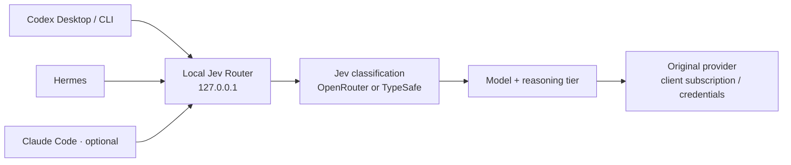

<p align="center">
  
</p>

<p align="center">
  <a href="https://github.com/AnhAnAsian/jev-desktop-hermes/actions/workflows/ci.yml"></a>
  
  
  <a href="LICENSE"></a>
</p>

# Jev for Codex Desktop & Hermes

**Pick Jev. Let it choose the model and reasoning effort. Keep your normal workflow.**

A lightweight localhost adapter around [flaviusapop/jev-router](https://github.com/flaviusapop/jev-router).
Jev classifies your first task, selects an editable tier, and pins the real model
for the conversation. No parent model needs to run before classification.
Your coding client keeps its login, tools, permissions and sessions.

[Get started](#get-started) · [Settings](#settings-without-editing-json) · [How it works](#how-it-works) · [Limits](#what-is-verified)

> **Experimental macOS software.** Automated tests run on macOS and Linux;
> startup installation supports macOS. Live compatibility depends on your client
> version and account. This repository is currently private.

## What you get

| In your workflow | What Jev adds |
| :--- | :--- |
| **Codex Desktop** | Jev, Jev Luna and Jev Sol in the normal model picker; parent request routing through a local Responses provider |
| **Hermes** | `/model jev` on the existing Codex OAuth or supported Anthropic provider |
| **Local settings** | Tier mappings, reasoning, pause/resume, routing mode, fallback and classification length |
| **Codex CLI** | Compatible launcher and shared provider configuration |
| **Claude Code** | Optional experimental integration; live authentication/generation still requires validation |

One service. No LiteLLM. No required OpenRouter coding-model provider.
Astra/Fable are excluded from the default automatic mappings.

## Get started

### Before installing

You need **macOS, Node 22+, Python 3.11+, Git**, and Codex Desktop already signed in.
Open Desktop's model picker once so its catalog is cached. The default installer
checks for `gpt-6-luna` and `gpt-6.1-sol` on your account.

Hermes is optional: set it up normally first, using an explicit supported provider
(`openai-codex`, `anthropic` or `claude`). The installer preserves its provider and
refuses unsupported transports instead of converting authentication.

### Fresh installation

```sh
git clone https://github.com/AnhAnAsian/jev-desktop-hermes.git
cd jev-desktop-hermes
npm ci --ignore-scripts
npm run bootstrap
npm run validate
npm test --prefix upstream
python3 scripts/install.py --hermes
```

Omit `--hermes` for Desktop only. Add `--claude` only to opt into the experimental
Claude integration. Use a Python 3.11+ interpreter explicitly if `python3` is older.
Private repository access requires your existing GitHub authentication.

**Already installed?** The installer intentionally refuses to overwrite existing
code or private state. Follow [the upgrade procedure](docs/OPERATIONS.md#existing-installation--adapter-migration).
`git pull` updates your checkout, not the installed service.

### Add the classifier key privately

Run in your own terminal; key entry is hidden:

```sh
~/.local/bin/jev-router key --openrouter
~/.local/bin/jev-router doctor
```

For direct TypeSafe classification, use [the documented backend configuration](docs/SETTINGS.md).
Never paste a key into chat. Your key is stored outside this repository with
owner-only permissions. **Jev classification is a separate paid service:**
OpenRouter credits or TypeSafe access are required; coding requests use your
original provider/subscription.

Restart enabled clients. Select **Jev** in a new Desktop chat or `/model jev` in
Hermes. A user LaunchAgent starts the localhost service at login. You can use
Desktop normally without starting a terminal wrapper.

## Settings without editing JSON

```sh
~/.local/bin/jev-router settings
```

Or open **[127.0.0.1:48767/settings](http://127.0.0.1:48767/settings)**.

Use native model dropdowns populated from your local Codex catalog. Reasoning
choices follow known model capabilities; unlisted saved IDs stay visible with a
warning. Choose **Enter a custom model ID…** when needed.

Edit the model/reasoning for each tier, turn tiers on or off, select conversation
or per-turn routing, choose the fallback, and limit the classification excerpt.
Every save validates and merges your changes, creates a private backup, and
rejects stale edits from another window. Keys and upstream URLs are not exposed.

New chats use updated mappings; existing pinned chats keep their model and effort.
After changing model IDs, run `jev-router refresh-catalog` and restart Desktop
so its advertised context limits match the new map. Other settings reload live.

<details>
<summary><strong>Preview the settings page</strong></summary>


Preview uses example configuration and fake classifier readiness; no real key or private client data appears.

</details>

Pausing in settings keeps the proxy running and uses the configured fallback for
Jev selections. For direct client operation, use `jev-router disable` and restart
clients. Family variants and advanced settings stay in
`~/.config/jev-router/config.json`. Read [the settings guide](docs/SETTINGS.md).

## Default model map

| Tier | Codex / Hermes Codex | Reasoning | Typical task |
| :--- | :--- | :--- | :--- |
| **FAST** | `gpt-6-luna` | medium | Small, familiar change |
| **BALANCED** | `gpt-6.1-sol` | low | Everyday implementation |
| **STRONG** | `gpt-6.1-sol` | high | Difficult debugging |
| **LONG** | `gpt-6.1-sol` | xhigh | Deep architecture or reasoning |

**Jev Luna** and **Jev Sol** stay within their respective families, using
low / medium / high / xhigh. Those picker IDs are local aliases; the proxy
translates them to real model IDs before inference.

Claude defaults: Haiku 4.5 without effort, Sonnet 5.5 high, Opus 5.5 high and
Opus 5.5 xhigh. Available models and reasoning levels depend on your account;
Codex catalog metadata is used to normalize supported efforts.

## How it works



The upstream classifier questions and decision policy are reused unchanged.
The adapter handles client integration, conversation pins, capability checks,
streaming and reversible configuration. OAuth stays with the clients; auth and
account headers are forwarded transiently without reading client token stores.

- Classify once per conversation by default; tool loops keep the same choice.
- Explicit directives such as `use fast tier: …` bypass classification.
- Picking a regular real model preserves manual usage.
- Independent subagent routing is possible when the client supplies enough identity.
- Classification failure uses the saved fallback. An absent proxy cannot forward requests.

The Desktop effort label does not dynamically reflect Jev's applied effort.
Check routing receipts instead of relying on the picker label.

## Everyday controls

Add `~/.local/bin` to your PATH for shorter commands.

| Command | Purpose |
| :--- | :--- |
| `jev-router settings` | Open local settings |
| `jev-router status` / `doctor` | Service state / integration diagnostics |
| `jev-router logs --follow` | Live routing metadata and served-model receipts |
| `jev-router disable` / `enable` | Restore direct clients / re-enable routing; restart clients afterward |
| `jev-router restart` | Restart the service; clears conversation pins |
| `jev-router desktop-disable` | Restore only Desktop's provider/catalog |
| `jev-router refresh-catalog` | Refresh model metadata and picker catalog; restart Desktop afterward |

`stop` restores client integrations before unloading startup. `start` registers
and starts the service; `enable` applies client routing. The root
[Ask Jev page](http://127.0.0.1:48767/) remains a manual recommendation tool.

## Privacy by default

Classification sends up to **8,000 characters of task text** to Jev through the
selected backend. You can change that limit in settings. Do not submit text you
cannot share with that service.

The proxy binds to `127.0.0.1`; logs contain routing metadata, not prompts, source
code, authorization headers or tokens. The settings API requires a same-origin
request and a process-specific token for saves. It does not manage API keys.
Local software running under your account can access the router.

Read [SECURITY.md](SECURITY.md) for the trust boundary and reporting guidance.

## What is verified

Automated suites cover routing, HTTP/WebSocket transport, pinning, overrides,
opaque authentication headers, capability normalization, settings saves, stale
edits, installation failure recovery and selective configuration restoration.
CI also runs the unchanged upstream suite, without paid keys or client logins.

Normal Desktop parent routing and Hermes task/resume routing were observed on the
original development setup. Provider metadata confirmed served models; reasoning
was verified outbound, not independently acknowledged. The settings UI is checked
in a browser at desktop/mobile widths. Private session receipts stay outside Git.

**Remaining limits:** conversation pins reset on restart; comprehensive Desktop
Computer Use, compaction, all real tiers and Claude generation remain unverified.
Cache hits are not guaranteed, and cache-preserving `configuration_update` items
are not implemented. Linux CI does not imply a Linux startup installer.

Use [the live acceptance checklist](docs/VALIDATION.md) on each target Mac.

## Updates & recovery

The adapter release locks the unmodified upstream revision in `upstream.lock.json`.
Bootstrap installs locked dependencies. Updating upstream and updating this adapter
are separate operations: `jev-router update` advances only the installed upstream.
For reproducible updates, validate the checkout and follow
[operations and migration](docs/OPERATIONS.md).

`jev-router uninstall` restores owned client settings, removes startup and owned
commands, and retains code, private keys and backups for recovery. After verifying
normal clients work, follow [complete removal](docs/OPERATIONS.md#disable-and-uninstall).

## Built on Jev

This adapter exists because [jev-router](https://github.com/flaviusapop/jev-router)
already provides the classification and routing policy. See [NOTICE](NOTICE) for
attribution. Licensed [MIT](LICENSE). Independent project; not affiliated with
OpenAI, Anthropic, OpenRouter, TypeSafe or upstream maintainers.
