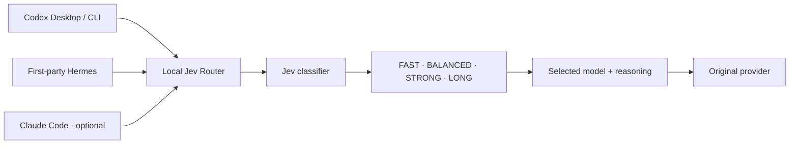

<p align="center">
  
</p>

<p align="center">
  <a href="https://github.com/AnhAnAsian/jev-desktop-hermes/actions/workflows/ci.yml"></a>
  
  
  
  <a href="LICENSE"></a>
</p>

<p align="center">
  <strong>Automatic model selection for Codex Desktop and first-party Hermes.</strong><br>
  One local service. Editable reasoning tiers. Your existing client login.
</p>

<p align="center">
  <a href="#get-started">Install</a> ·
  <a href="#make-it-yours">Settings</a> ·
  <a href="docs/CLIENTS.md">Client guide</a> ·
  <a href="docs/OPERATIONS.md">Updates &amp; recovery</a> ·
  <a href="docs/VALIDATION.md">Test evidence</a>
</p>

## Choose Jev. Start your task.

A typo and an unknown concurrency bug don't need the same model. Select **Jev**
in your client and describe the task. Jev classifies it, chooses a real model and
reasoning effort, then keeps that choice for the conversation by default.

No answering model runs before the classifier. Coding requests continue through
your original provider; the classifier uses separate OpenRouter credits or TypeSafe
access. This is a small adapter around the unmodified
[upstream Jev Router](https://github.com/flaviusapop/jev-router), not a new classifier.

> **Experimental, with explicit limits.** macOS startup is supported; CI runs on
> macOS and Linux. Live behavior depends on client versions, model access and auth.
> Model switching does not guarantee prompt-cache hits.

## Where it works

| Client | How you use it | Current evidence |
| :--- | :--- | :--- |
| **Codex Desktop** | Select **Jev**, **Jev Luna** or **Jev Sol** in the normal picker | Parent request routing and served-model receipts observed |
| **First-party Hermes** | `/model jev`, `/model jev-luna`, `/model jev-sol` on Codex OAuth; picker catalog entries also installed | All three profiles verified in the CLI; native GUI refresh still needs visual acceptance |
| **Codex CLI** | Shared provider configuration or `jev-codex` | Adapter coverage; repeat live acceptance on your installation |
| **Claude Code terminal / Hermes Anthropic** | Optional Anthropic proxy integration | Automated coverage; live Anthropic generation unverified |
| **Claude Desktop Chat / Cowork** | Use the local **Ask Jev** page for advice, then choose a model manually | Automatic integration is not installed |

The Anthropic map in settings is for the optional Anthropic integrations. It does
**not** change Hermes's provider or add Jev to Claude Desktop. We keep Claude
Desktop's normal login: its documented third-party gateway mode is a separate
deployment, and subscription-preserving routing has not been established.
See [client details and troubleshooting](docs/CLIENTS.md).

## Get started

You need **macOS, Node 22+, Python 3.11+, Git**, and Codex Desktop already signed
in. Open Desktop's model picker once to populate its cached catalog. The installer
checks that the default `gpt-6-luna` and `gpt-6.1-sol` models are available.

### 1. Install on a fresh Mac

```sh
git clone https://github.com/AnhAnAsian/jev-desktop-hermes.git
cd jev-desktop-hermes
npm ci --ignore-scripts
npm run bootstrap
npm run validate
npm test --prefix upstream
python3 scripts/install.py --hermes
```

The repository is private; cloning uses your existing GitHub authentication.
Omit `--hermes` for Codex Desktop only. For Hermes, configure its normal provider
first: `openai-codex`, `anthropic` or `claude`. The installer preserves it and
refuses unsupported transports. Add `--claude` only for the experimental Claude
Code terminal integration. Use an explicit Python 3.11+ executable if needed.

**Already installed?** Use the [migration guide](docs/OPERATIONS.md#existing-installation--adapter-migration).
The installer refuses to overwrite existing code or private state. Pulling the
repository alone does not update the running service.

### 2. Add the classification key

```sh
~/.local/bin/jev-router key --openrouter
~/.local/bin/jev-router doctor
```

Enter the key privately in your terminal; input is hidden. Keys stay outside Git
with owner-only permissions. For direct TypeSafe access, see
[classifier settings](docs/SETTINGS.md#advanced-configuration).

### 3. Select Jev in a new conversation

Restart enabled clients. Choose **Jev** in Codex Desktop, or run `/model jev` in
Hermes on Codex OAuth. A user LaunchAgent starts the router at login, so Desktop
needs no terminal wrapper. Check a real response with `jev-router logs --follow`:
the picker label alone doesn't prove which model answered.

## Make it yours

```sh
~/.local/bin/jev-router settings
```

The [local settings page](http://127.0.0.1:48767/settings) is part of the same
service. Model dropdowns use the local Codex catalog; reasoning choices follow
known capabilities. Saved unlisted IDs remain visible with a warning.


<sub>Example configuration. Classifier readiness is simulated; no private keys or client data are shown.</sub>

Choose a **routing profile** to edit its four tiers and fallback. Set selection
timing separately for Codex, Hermes and Claude: once per conversation or once per
new human turn. Editing a profile here doesn't activate it in a client.

| Profile | Model selection | Default FAST → LONG reasoning |
| :--- | :--- | :--- |
| **Jev** | Luna for FAST; Sol for the other tiers | medium · low · high · xhigh |
| **Jev Luna** | Luna family only | low · medium · high · xhigh |
| **Jev Sol** | Sol family only | low · medium · high · xhigh |
| **Claude / Anthropic** | Haiku 4.5 · Sonnet 5.5 · Opus 5.5 · Opus 5.5 | default · high · high · xhigh |

These are repository defaults, not a copy of your personal settings. Everything
is editable in one `~/.config/jev-router/config.json`. Astra/Fable are excluded
from automatic defaults. Available models and effort levels depend on the provider.

Each save validates a bounded merge, makes a private backup and rejects stale edits.
New conversations use the new map; existing pins keep their choice. After changing
model IDs, run `jev-router refresh-catalog` and restart Desktop to refresh context
metadata. Keys and upstream URLs aren't exposed in the editor.

Read [the settings guide](docs/SETTINGS.md) for exact behavior.

## One service, one chosen answering model



The adapter reuses upstream classification questions and decision policy. It adds
picker catalogs, conversation pins, streaming transport and reversible config
merges. Client authentication headers are forwarded transiently; OAuth login and
refresh stay with the original clients. No LiteLLM or extra frontend server.

- **Keep the choice:** Codex/Hermes default to conversation routing; tool loops stay pinned. Optional Claude defaults to per-turn routing.
- **Take control:** explicit tier directives bypass classification; regular real-model selections remain manual.
- **Handle failure:** failed classification uses your saved fallback. A stopped proxy cannot forward requests.
- **Inspect the result:** logs include routing decisions and served-model receipts. Outbound effort isn't independent provider confirmation.
- **Protect the boundary:** only `127.0.0.1` listens. Metadata logs omit prompts, source code and credentials.

Pins are held in memory and reset on restart. Subagents can route independently
when the client supplies enough identity. The displayed picker effort isn't
updated to reflect the selected backend effort.

## Daily controls

Add `~/.local/bin` to your PATH for these shorter commands.

| I want to… | Command |
| :--- | :--- |
| Edit maps / pause classification | `jev-router settings` |
| Inspect decisions | `jev-router logs --follow` |
| Check service / integration health | `jev-router status` / `jev-router doctor` |
| Use clients directly / restore routing | `jev-router disable` / `jev-router enable`, then restart clients |
| Restart the service | `jev-router restart` |

Pausing in settings keeps the proxy active and uses the configured fallback for
Jev selections. Disabling restores owned client settings. `stop` restores clients
before stopping the listener; `start` starts the service, while `enable` applies
client routing. See [all operational controls](docs/OPERATIONS.md).

## Your text and your credentials

**Classification is not local:** up to 8,000 task characters by default are sent
to TypeSafe/Jev, directly or through OpenRouter. The limit is editable. Use a real
manual model or disable routing when the text must not reach the classifier.

The service doesn't open client OAuth token stores. Logs use an allowlist of
routing metadata. Browser saves require exact same-origin and a process-specific
token. Local software under your account can still access the listener; localhost
is not an authentication boundary. Details: [SECURITY.md](SECURITY.md).

## Evidence, updates and recovery

The current gate covers **39 Node + 17 Python + 154 upstream tests**. CI runs
without paid keys or client logins. See [validation](docs/VALIDATION.md) for dated
live observations and the acceptance checklist for another Mac.

Live Anthropic generation, comprehensive Desktop Computer Use/compaction, all
real coding tiers and reboot acceptance remain outstanding. Cache hits aren't
guaranteed; cache-preserving `configuration_update` items aren't implemented.
Linux CI doesn't imply a Linux startup installer.

The release pins unmodified upstream in `upstream.lock.json`. Updating this adapter
and running `jev-router update` are different: the latter advances installed
upstream only. Follow [updates and rollback](docs/OPERATIONS.md) deliberately.

`jev-router uninstall` restores owned client settings and removes startup/command
shims. It retains code, keys and backups for recovery; the guide explains
[complete removal](docs/OPERATIONS.md#disable-and-uninstall).

## Built on upstream, kept small

Credit belongs to [flaviusapop/jev-router](https://github.com/flaviusapop/jev-router)
for the classifier integration and decision policy. This project covers the
Desktop/Hermes integration gap. See [NOTICE](NOTICE) and [MIT license](LICENSE).

Want to improve it? Start with [CONTRIBUTING.md](CONTRIBUTING.md).
Independent project; not affiliated with OpenAI, Anthropic, Nous Research,
OpenRouter, TypeSafe or the upstream maintainers.
