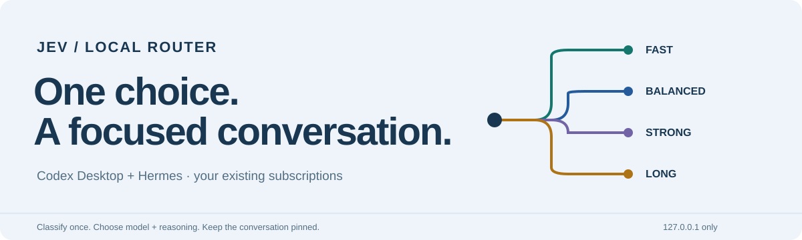
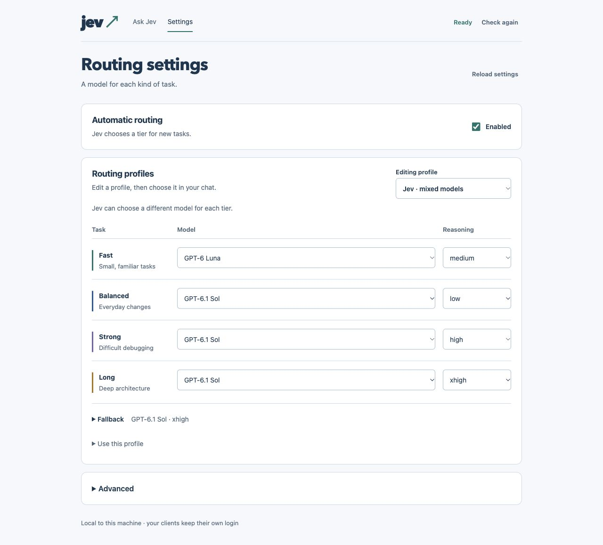
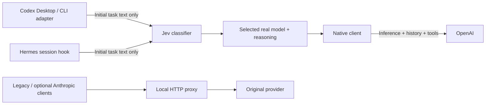

<p align="center">
  
</p>

<p align="center">
  <a href="https://github.com/AnhAnAsian/jev-codex-hermes/actions/workflows/ci.yml"></a>
  
  
  
  <a href="LICENSE"></a>
</p>

<p align="center">
  <strong>Jev for Codex &amp; Hermes</strong><br>
  Automatic model selection for Codex Desktop, terminal Codex and first-party Hermes.<br>
  Select once. Run native. Keep your existing client login.
</p>

<p align="center">
  <a href="#get-started">Install</a> ·
  <a href="#make-it-yours">Settings</a> ·
  <a href="docs/CLIENTS.md">Client guide</a> ·
  <a href="docs/OPERATIONS.md">Updates &amp; recovery</a> ·
  <a href="docs/VALIDATION.md">Test evidence</a>
</p>

## Choose Jev. Start your task.

A typo and an unknown concurrency bug don't need the same model. Select **Jev**
in your client and describe the task. Jev classifies it, chooses a real model and
reasoning effort, then keeps that choice for the conversation by default.

No answering model runs before the classifier. Coding requests continue through
your original provider; the classifier uses separate OpenRouter credits or TypeSafe
access. This is a small adapter around the unmodified
[upstream Jev Router](https://github.com/flaviusapop/jev-router), not a new classifier.

**Native first-request mode is now available.** Jev sees only the initial human
task text and chooses a real model/effort. Subsequent inference, history, tool
loops and compaction go directly from the native client to OpenAI. Manual real
models skip classification. The existing HTTP proxy remains available for legacy
clients and experimental Anthropic routes. Native mode is an explicit opt-in;
pulling this repository does not migrate an installed client.

> **Experimental, with explicit limits.** macOS startup is supported; CI runs on
> macOS and Linux. Live behavior depends on client versions, model access and auth.
> The verified scope is Codex Desktop and first-party Hermes on Codex OAuth.
> Anthropic routes are experimental API-auth integrations, not promised Claude
> subscription support. Routing does not guarantee cache hits or quota savings.

## Where it works

| Client | How you use it | Current evidence |
| :--- | :--- | :--- |
| **Codex Desktop** | Enable native mode; select **Jev**, **Jev Luna** or **Jev Sol** | Native OpenAI selection/follow-up/manual-model probes passed; picker notification ordering tested |
| **First-party Hermes** | Install the native extension; `/model jev` on Codex OAuth | First request, resumed follow-up and manual Sol passed without proxy inference; GUI visual acceptance pending |
| **Codex CLI** | Native launcher: normal `codex` or `jev-codex` | Interactive, exec and resume passed on native 0.160.0; selected model/effort visible |
| **Claude Code terminal / Hermes Anthropic** | Optional experimental API-auth proxy integration | Automated coverage; live Anthropic generation unverified; consumer OAuth routing is not a supported feature |
| **Claude Desktop Chat / Cowork** | Use the local **Ask Jev** page for advice, then choose a model manually | Automatic integration is not installed |

The Anthropic map in settings is for the optional Anthropic integrations. It does
**not** change Hermes's provider or add Jev to Claude Desktop. We keep Claude
Desktop's normal login: its documented third-party gateway mode is a separate
deployment, and subscription-preserving routing has not been established.
See [client details and troubleshooting](docs/CLIENTS.md).
Tested client versions and release limitations are recorded in
[the compatibility snapshot](docs/VALIDATION.md#compatibility-snapshot).

## Get started

You need **macOS, Node 22+, Python 3.11+, Git**, and Codex Desktop already signed
in. Open Desktop's model picker once to populate its cached catalog. The installer
checks that the default `gpt-6-luna` and `gpt-6.1-sol` models are available.

### 1. Install on a fresh Mac

```sh
git clone https://github.com/AnhAnAsian/jev-codex-hermes.git
cd jev-codex-hermes
npm ci --ignore-scripts
npm run bootstrap
npm run validate
npm test --prefix upstream
python3 scripts/install.py --hermes
```

Omit `--hermes` for Codex Desktop only. For Hermes, configure its normal provider
first: `openai-codex`, `anthropic` or `claude`. The installer preserves it and
refuses unsupported transports. Add `--claude` only for the experimental Claude
Code terminal integration with your own authorized Anthropic API credentials;
API billing is separate from a Claude subscription. An Anthropic provider label
alone does not establish permitted authentication. Use an explicit Python 3.11+
executable if needed.

**Already installed?** Use the [migration guide](docs/OPERATIONS.md#existing-installation--adapter-migration).
The installer refuses to overwrite existing code or private state. Pulling the
repository alone does not update the running service. It initially installs the
legacy proxy integration; enable native mode separately below.

### 2. Add the classification key

```sh
~/.local/bin/jev-router key --openrouter
~/.local/bin/jev-router doctor
```

Enter the key privately in your terminal; input is hidden. Keys stay outside Git
with owner-only permissions. For direct TypeSafe access, see
[classifier settings](docs/SETTINGS.md#advanced-configuration).

### 3. Enable native mode and select Jev

```sh
~/.local/bin/jev-router desktop-native-enable
```

Quit and reopen Desktop, then choose **Jev** in a new chat. Desktop's picker
shows the selected real model and effort after routing. A user LaunchAgent sets
the native runtime override at login.

For Hermes and terminal Codex, follow the [native client setup](docs/NATIVE-ROUTING.md).
The current combined installer needs the active Hermes source/interpreter paths,
an existing terminal `codex` symlink and the native catalog created above. It
backs up the Hermes hook changes and original launcher. Restart Hermes afterward;
new terminal invocations activate immediately. Hermes reports the selected model;
interactive Codex shows it in the footer and exec prints it on stderr.

Check response metadata as well as `native-first-request` receipts; a classifier
result alone does not prove generation. Repeat a follow-up and confirm no new
classification or Jev HTTP inference receipt.

## Make it yours

```sh
~/.local/bin/jev-router settings
```

The [local settings page](http://127.0.0.1:48767/settings) is part of the same
service. Model dropdowns use the local Codex catalog; reasoning choices follow
known capabilities. Saved unlisted IDs remain visible with a warning.



<sub>Example configuration. Classifier readiness is simulated; no private keys or client data are shown.</sub>

Choose a **routing profile** to edit its four tiers and fallback. Set selection
timing separately for legacy proxy clients: once per conversation or once per
new human turn. Native mode always selects only for a new chat; it does not
reclassify follow-ups. Editing a profile here doesn't activate it in a client.

| Profile | Model selection | Default FAST → LONG reasoning |
| :--- | :--- | :--- |
| **Jev** | Luna for FAST; Sol for the other tiers | medium · low · high · xhigh |
| **Jev Luna** | Luna family only | low · medium · high · xhigh |
| **Jev Sol** | Sol family only | low · medium · high · xhigh |
| **Claude / Anthropic** | Haiku 4.5 · Sonnet 5.5 · Opus 5.5 · Opus 5.5 | default · high · high · xhigh |

These are repository defaults, not a copy of your personal settings. Everything
is editable in one `~/.config/jev-router/config.json`. Astra/Fable are excluded
from automatic defaults. Available models and effort levels depend on the provider.

Each save validates a bounded merge, makes a private backup and rejects stale edits.
New conversations use the new map; existing pins keep their choice. After changing
model IDs, run `jev-router refresh-catalog` and restart Desktop to refresh context
metadata. Keys and upstream URLs aren't exposed in the editor.

Read [the settings guide](docs/SETTINGS.md) for exact behavior.

## Select once, then use native inference



The adapter reuses upstream classification questions and decision policy. It adds
picker catalogs, conversation pins, native client adapters and reversible config
merges. In native mode, login, tokens and inference remain with the original
client. Legacy proxy routes forward authentication headers transiently. No
LiteLLM or extra frontend server.

- **Keep the choice:** native Codex/Hermes select once and restore saved real model/effort on resume; optional Claude defaults to per-turn routing.
- **Take control:** explicit tier directives bypass classification; regular real-model selections remain manual.
- **Handle failure:** failed classification uses your saved fallback. Already selected native chats continue without the HTTP proxy; legacy routes need it running.
- **Inspect the result:** native clients show the selected model/effort; metadata receipts record selection. Outbound effort isn't independent provider confirmation.
- **Protect the boundary:** only `127.0.0.1` listens. Metadata logs omit prompts, source code and credentials.

Native Codex restores model/effort from thread metadata. Hermes also stores bounded
profile-scoped pins; legacy HTTP proxy pins remain in memory and reset on restart.
The native Codex/subagent catalog contains real models only. Hermes updates can
replace its local core hook; revalidate and reapply the extension after upgrading.

## Daily controls

Add `~/.local/bin` to your PATH for these shorter commands.

| I want to… | Command |
| :--- | :--- |
| Edit maps / pause classification | `jev-router settings` |
| Inspect decisions | `jev-router logs --follow` |
| Check service / integration health | `jev-router status` / `jev-router doctor` |
| Restore Hermes and terminal launchers | `jev-router native-clients-disable`, then restart Hermes |
| Restore the previous Desktop mode | `jev-router desktop-native-disable`, then restart Desktop |
| Use clients directly / restore routing | `jev-router disable` / `jev-router enable`, then restart clients |
| Restart the service | `jev-router restart` |

Pausing in settings keeps the proxy active and uses the configured fallback for
Jev selections. Disabling restores owned client settings. `stop` restores clients
before stopping the listener; `start` starts the service, while `enable` applies
client routing. See [all operational controls](docs/OPERATIONS.md).

## Your text and your credentials

**Classification is not local:** up to 8,000 task characters by default are sent
to TypeSafe/Jev, directly or through OpenRouter. The limit is editable. Use a real
manual model or disable routing when the text must not reach the classifier.
The classifier uses paid OpenRouter credits or TypeSafe access. It is separate
from answering-model usage: original provider quotas and billing still apply,
and auxiliary client requests can consume usage. This project promises neither
quota reductions nor a particular cache hit rate.

The service doesn't open client OAuth token stores. Logs use an allowlist of
routing metadata. Browser saves require exact same-origin and a process-specific
token. Local software under your account can still access the listener; localhost
is not an authentication boundary. Details: [SECURITY.md](SECURITY.md).
Report vulnerabilities through [the private GitHub security form](https://github.com/AnhAnAsian/jev-codex-hermes/security/advisories/new)
once it is enabled for public release; the security policy describes private-phase
reporting and what information to include.

## Evidence, updates and recovery

The current gate covers **67 Node + 32 Python tests**, plus the **154-test pinned
upstream suite**. A separate isolated Hermes regression run passed **127 tests**. CI runs
without paid keys or client logins. See [validation](docs/VALIDATION.md) for dated
live observations and the acceptance checklist for another Mac.
Use [clean-install acceptance](docs/CLEAN-INSTALL.md) to test a fresh public
checkout safely, then verify login, the native picker, real receipts and startup
on a clean Mac account. Automated packaging tests do not establish live acceptance.

Live native Hermes first/follow-up/manual-model requests and terminal
interactive/exec/resume requests passed; native CLI cached input was observed
with unchanged effort. Live Anthropic generation, comprehensive Desktop Computer
Use/compaction, all real coding tiers and reboot acceptance remain outstanding.
The new live probes executed no tools. Cache hits aren't guaranteed. Native Codex
0.160.0 preserved cached prefixes across Sol effort changes with
`features.reasoning_effort_override=true`; the native engine owns the updates.
The Hermes native extension now preserves the request effort and appends ordered
updates; live Sol swaps retained cached prefixes, including after SQLite resume
and local compression. Hermes keeps its own tools and memory. Supported standard
single-agent requests only; see [setup and cache limits](docs/NATIVE-ROUTING.md#reasoning-changes-and-caching).
Linux CI doesn't imply a Linux startup installer.

The release pins unmodified upstream in `upstream.lock.json`. Updating this adapter
and running `jev-router update` are different: the latter advances installed
upstream only. Follow [updates and rollback](docs/OPERATIONS.md) deliberately.

`jev-router uninstall` restores owned client settings and removes startup/command
shims. It retains code, keys and backups for recovery; the guide explains
[complete removal](docs/OPERATIONS.md#disable-and-uninstall).

## Built on upstream, kept small

Credit belongs to [flaviusapop/jev-router](https://github.com/flaviusapop/jev-router)
for the classifier integration and decision policy. This project covers the
Desktop/Hermes integration gap. See [NOTICE](NOTICE) and [MIT license](LICENSE).

Want to improve it? Start with [CONTRIBUTING.md](CONTRIBUTING.md).
Found a bug? Use [the guided report form](https://github.com/AnhAnAsian/jev-codex-hermes/issues/new?template=bug_report.yml)
with versions and a synthetic reproduction; keep private prompts and credentials out.
Dependency updates follow [an individual review gate](docs/DEPENDENCY-REVIEW.md);
major updates stay unmerged until validated.
Independent project; not affiliated with OpenAI, Anthropic, Nous Research,
OpenRouter, TypeSafe or the upstream maintainers.

Maintainers: use [the public-release checklist](docs/PUBLIC-RELEASE.md) before
changing visibility. Publishing and enabling GitHub security features are separate
steps; the security helper never changes visibility.
